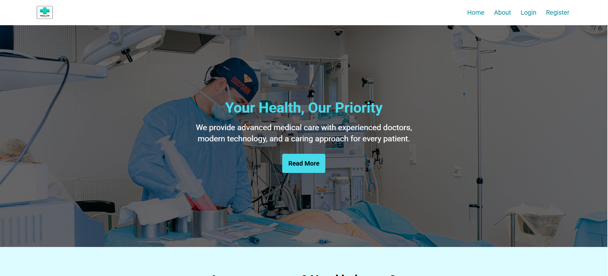
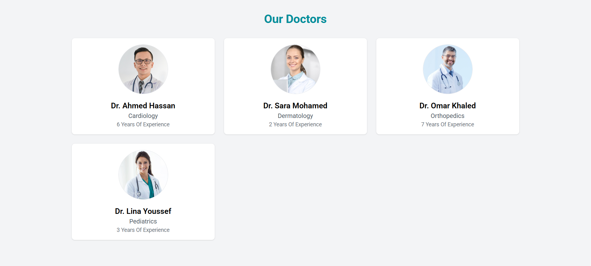
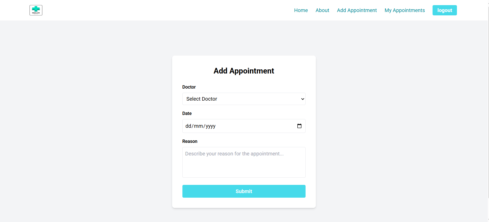
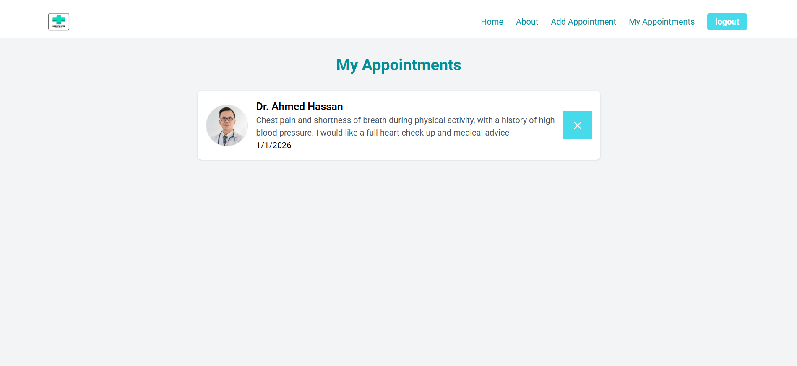

# 🏥 Doctor Appointment System

A full-stack web application for managing doctor appointments, built with the MERN stack.

---

## Overview

Doctor Appointment System is a comprehensive healthcare management platform that allows patients to browse doctors, book appointments, and manage their medical schedules. Administrators can manage doctors, departments, and monitor system statistics.

---

## Features

-  User registration and authentication
-  Browse doctors
-  Book, view, and cancel appointments
-  Filter doctors by specialty
-  Create and manage departments
-  Add and manage doctor profiles
-  Role-based access control
-  Responsive design for all devices

---

## Tech Stack

### Frontend
- **React.js**
- **React Router** - Client-side routing
- **Tailwind CSS** - Styling framework

### Backend
- **Node.js**
- **Express.js**
- **MongoDB**
- **Mongoose** - ODM for MongoDB
- **JWT** - Authentication tokens

---

## Project Structure

```
doctor-appointment/
│
├── frontend/              # React frontend application
│   ├── src/
│   │   ├── App.js
│   │   ├── index.css
│   │   └── index.js
│   ├── package.json
│   ├── package-lock.json
│   ├── tailwind.config.js
│   └── README.md
│
├── backend/               # Express backend API
│   ├── src/
│   │   └── server.js
│   ├── uploads/           # Uploaded files storage
│   ├── .env
│   ├── package.json
│   └── package-lock.json
│
├── postman/               # API collections
│   └── doctor-appointment.postman_collection.json
│
├── screenshots/           # UI screenshots
├── .gitignore
└── README.md              # Main project README
```

---

## Screenshots

<table>
  <tr>
    <td colspan="2">
      <h3 align="center">Home Page</h3>
      
    </td>
  </tr>
  <tr>
    <td width="50%">
      <h3 align="center">Doctors List</h3>
      
    </td>
    <td width="50%">
      <h3 align="center">Doctor Details</h3>
      
    </td>
  </tr>
  <tr>
    <td width="50%">
      <h3 align="center">Add Appointment</h3>
      
    </td>
    <td width="50%">
      <h3 align="center">My Appointments</h3>
      
    </td>
  </tr>
</table>

---

## Installation

1. **Clone the repository**
```bash
git clone https://github.com/gemmy404/doctor-appointment.git
cd doctor-appointment
```

2. **Setup Backend**
```bash
cd backend
npm install

# Create uploads folder
mkdir uploads
```

3. **Setup Frontend**
```bash
cd ../frontend
npm install
```

4. **Run the Application**

```bash
# Terminal 1 - Run backend
cd backend
npm run dev

# Terminal 2 - Run frontend
cd frontend
npm start
```

The application will be available at:
- Frontend: `http://localhost:3000`
- Backend API: `http://localhost:5000`

---

## API Documentation

### Base URL
```
http://localhost:5000/api/v1
```

### Authentication Endpoints

| Method | Endpoint | Description | Access |
|--------|----------|-------------|--------|
| POST | `/auth/register` | Register new user | Public |
| POST | `/auth/login` | Login user | Public |

### Department Endpoints

| Method | Endpoint | Description | Access |
|--------|----------|-------------|--------|
| GET | `/departments` | Get all departments | Public |
| POST | `/departments` | Create department | Admin |
| GET | `/departments/counts` | Get department statistics | Public |

### Doctor Endpoints

| Method | Endpoint | Description | Access |
|--------|----------|-------------|--------|
| GET | `/doctors` | Get all doctors | Public |
| GET | `/doctors/:id` | Get doctor by ID | Public |
| GET | `/doctors/filter?specialty=...` | Filter by specialty | Public |
| POST | `/doctors` | Create doctor | Admin |
| GET | `/doctors/counts` | Get doctor statistics | Public |

### Appointment Endpoints

| Method | Endpoint | Description | Access |
|--------|----------|-------------|--------|
| GET | `/appointments/my` | Get user appointments | User |
| POST | `/appointments` | Create appointment | User |
| DELETE | `/appointments/:id` | Delete appointment | User |

### Authentication

Include JWT token in request headers:
```http
Authorization: Bearer <your_jwt_token>
```

For detailed API documentation, see:
- [Backend README](./backend/README.md)
- [Frontend README](./frontend/README.md)

---

⭐ If you found this project helpful, please consider giving it a star!