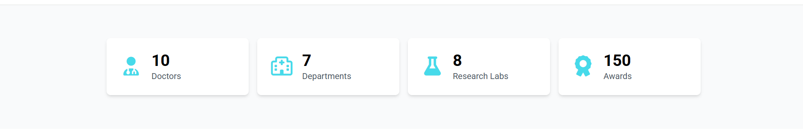

# Doctor Appointment System - Frontend

A modern, responsive web application for booking doctor appointments, built with React.js.

## Tech Stack

- **React.js** - JavaScript library for building user interfaces
- **React Router** - Navigation and routing
- **Tailwind CSS** - Utility-first CSS framework for styling

## Features

- User authentication (Register/Login)
- View departments and doctors
- Book, view, and cancel appointments
- Responsive design for all devices
- Protected routes for authenticated users

## Project Structure

```
frontend/
├── public/
│   ├── index.html
│   └── favicon.ico
├── src/
│   ├── components/
│   ├── pages/
│   ├── context/
│   ├── utils/
│   ├── App.jsx
│   ├── index.js
│   └── index.css
├── tailwind.config.js
├── package.json
└── package-lock.json
```

## Pages Overview

### Public Pages
- **Home** - Landing page with system overview
- **Login** - User authentication
- **Register** - New user registration
- **Doctors** - Browse all doctors with filtering
- **Doctor Details** - View detailed doctor information

### Protected Pages (Require Authentication)
- **Add Appointment** - Schedule new appointments
- **My Appointments** - View and manage user appointments

### Admin Only Pages
- **Add Doctor** - Create new doctor profiles
- **Add Department** - Create new departments

## API Integration

The frontend connects to the backend API at:

```
http://localhost:5000/api/v1
```

## Installation

1. Clone the repository

```bash
git clone https://github.com/gemmy404/doctor-appointment.git
cd doctor-appointment-frontend
```

2. Install dependencies

```bash
npm install
```

3. Set up Tailwind CSS

```bash
# Tailwind is already configured in the project
# The configuration files are:
# - tailwind.config.js
# - src/index.css (with Tailwind directives)
```

4. Start the development server

```bash
npm start
```

The app will run on `http://localhost:3000`

## Key Features Implementation

### Authentication Flow

- JWT token stored in localStorage
- Protected routes using React Router
- Admin-only routes with role verification
- Automatic redirect to login for unauthenticated users

### State Management

- React Context API for global auth state
- Local state management with useState hook
- Side effects handled with useEffect hook

### Routing

| Route | Description | Access Level | API Endpoint Used                                                                                 |
|-------|-------------|--------------|---------------------------------------------------------------------------------------------------|
| `/` | Home page | Public | `GET /departments/counts`<br/>`GET /doctors/counts` <br/> `GET /departments` <br/> `GET /doctors` |
| `/login` | Login page | Public | `POST /auth/login`                                                                                |
| `/register` | Register page | Public | `POST /auth/register`                                                                             |
| `/doctors` | All doctors | Public | `GET /doctors`<br/>`GET /doctors/filter?specialty=...`                                            |
| `/doctors/:id` | Doctor details | Public | `GET /doctors/:id`                                                                                |
| `/add-appointment` | Add appointment | Protected | `POST /appointments`                                                                              |
| `/my-appointments` | User appointments | Protected | `GET /appointments/my`                                                                            |
| `/add-doctor` | Add doctor | Admin Only | `POST /doctors`                                                                                   |
| `/add-department` | Add department | Admin Only | `POST /departments`                                                                               |


## Screenshots

<table>
  <tr>
    <td colspan="2">
      <h3 align="center">Home Page</h3>
      
    </td>
  </tr>
  <tr>
    <td width="50%">
      <h3 align="center">Our Doctors</h3>
      
    </td>
    <td width="50%">
      <h3 align="center">Doctor Details</h3>
      
    </td>
  </tr>
  <tr>
    <td width="50%">
      <h3 align="center">Add Appointment</h3>
      
    </td>
    <td width="50%">
      <h3 align="center">My Appointments</h3>
      
    </td>
  </tr>
  <tr>
    <td width="50%">
      <h3 align="center">Stats</h3>
      
    </td>
    <td width="50%">
      <h3 align="center">Departments</h3>
      
    </td>
  </tr>
  <tr>
    <td width="50%">
      <h3 align="center">Add Doctor (Admin)</h3>
      
    </td>
    <td width="50%">
      <h3 align="center">Add Department (Admin)</h3>
      
    </td>
  </tr>
</table>

---

⭐ If you found this project helpful, please consider giving it a star!